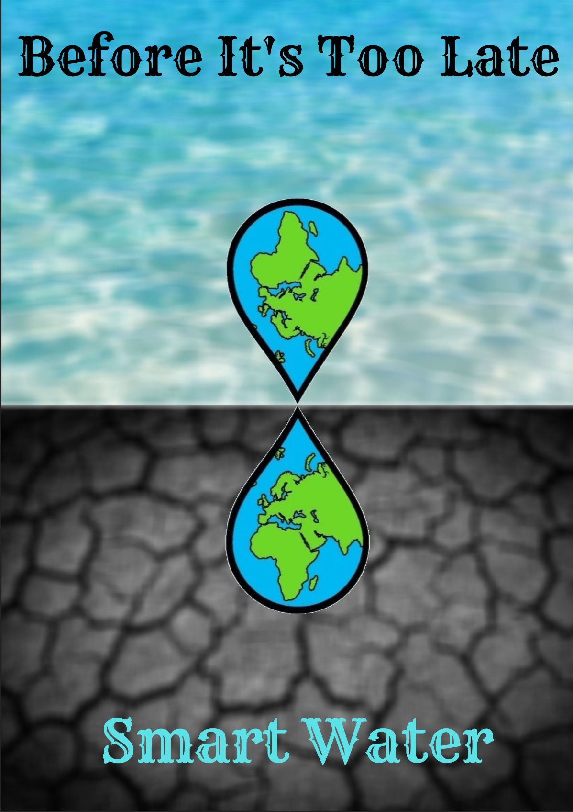
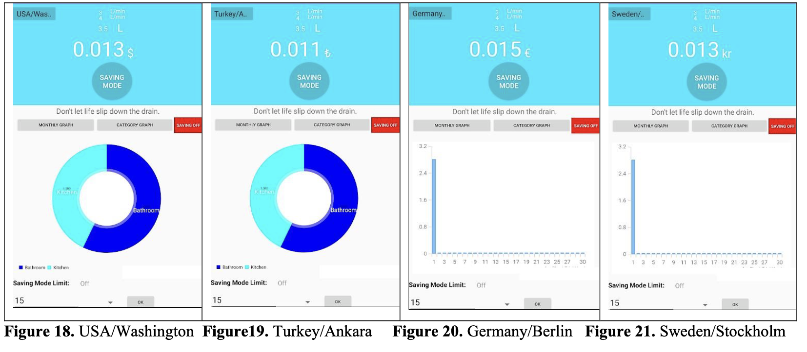
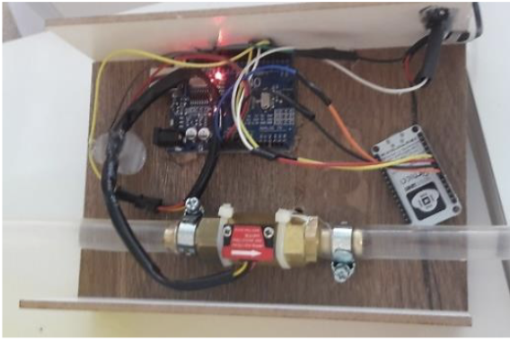
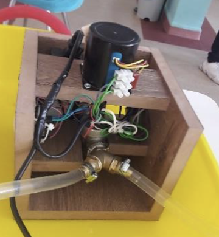
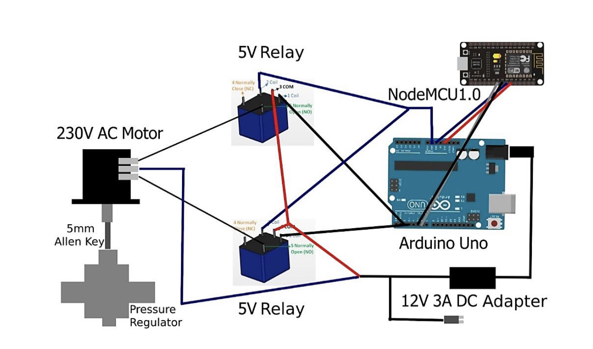

# Smart Water - Monitoring of Household Water Use and Control of Pressure with IoT and Cloud Database

This project aims to monitor household water usage and control pressure by integrating Internet of Things (IoT) devices and a cloud database system. The model enables users to track their water consumption in real-time, categorize water usage, and apply pressure-reducing mechanisms to save water efficiently.Here you can find the project **[poster](docs/poster.png)** and the detailed **[report](docs/report.pdf)**.

## Project Purpose

The core objectives of this project are:

1.	Real-Time Monitoring: Categorize and monitor water usage through an IoT-based metering system connected to Firebase cloud database.
2.	Access to Pricing Information: Provide instant access to water usage costs and consumption patterns according to region.
3.	User-Friendly Interface: Display water consumption and pressure control data through an accessible mobile application.
4.	Pressure Control Mechanism: Implement a pressure-reducing system along an algorithm to help limit water overuse and improve conservation efforts.

## Features

-	Instant Display of Water Usage: Track the total water consumption in liters and the associated costs based on per capita usage.
-	Water Usage Categorization: Analyze water consumption within the household to identify areas of improvement.
-	Pressure Reduction Mechanism: Apply a smart pressure reducer to minimize excess water flow and ensure efficient water usage.
-	Mobile Interface: A mobile app pulls data from Firebase to display categorized water usage and pricing.

## Technologies Used

-	NodeMCU ESP8266: Used to connect water meters to the cloud by transmitting data to the Firebase database.
-	Firebase: Cloud database storing water consumption data.
-	Arduino: Controls pressure reducers and receives commands to adjust water flow based on the data.
-	Mobile Application: Displays water usage and alerts users when certain consumption thresholds are reached.
-	Internet of Things (IoT): Enables real-time data collection from household water meters.

## Methodology

1.	Data Collection: Water meters are installed at water outlets (e.g., taps, showers) to measure water flow. The data is then sent to the cloud via Wi-Fi.
2.	Data Storage: The collected data is stored in a Firebase cloud database.
3.	Pressure Control: A motor controls the pressure reducer based on water consumption patterns, enabling pressure adjustment in real time.
4.	Mobile Interface: The mobile app pulls data from Firebase to display consumption statistics, pricing, and the functionality of the pressure-reduction system.

## Photos and Screenshots

### Mobile App

### Smart Water Meter and Pressure Reducer

### Circuit Diagram for Smart the Pressure Reducer

## Results

-	The system successfully provided real-time water consumption data in liters.
-	A pressure reduction of 13% was achieved, contributing to water conservation without affecting the user experience.
-	Water usage data was categorized, and deviations were measured to be less than 2% at all measurement periods.

## Conclusion

This project demonstrates a comprehensive solution to managing household water consumption through real-time monitoring, cloud storage, and pressure control algorithm. It promotes water conservation by making users aware of their usage patterns and provides a cost-effective way to reduce water waste.

## Future Enhancements

-	Integration of the mobile app into households to create widespread awareness of water usage.
-	Expansion of the pressure reduction mechanism to ensure compatibility with various household appliances.
-	Broader applications in agriculture, hydrology, and other water management fields.

## Contributors

-	**Kaan Uz**: kaanuz2003@gmail.com
-	**Ali S. Ural**: ali.semih.ural@drexel.edu

## Acknowledgments

This project was developed for the Stockholm Junior Water Prize 2022 on behalf of Turkey, focusing on global water conservation efforts.
